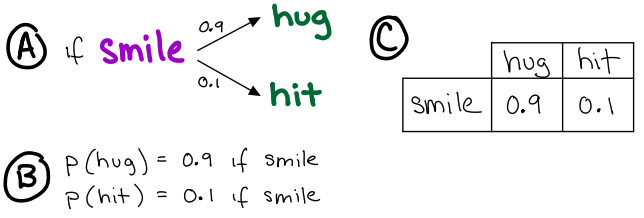
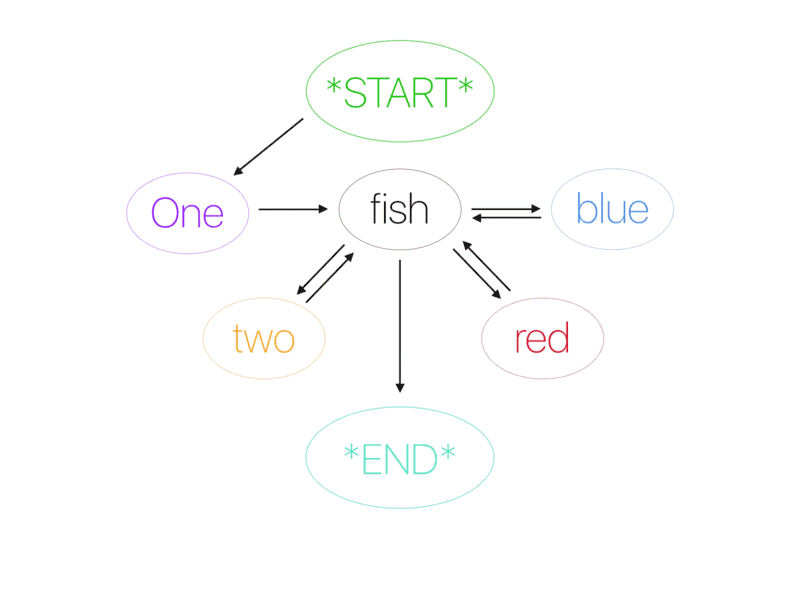

# Analysis

:::{admonition} Why?
Equally important to an animal's behavioral actions is how those actions get distributed through time. The methods that we use to analyze this time allocation therefore directly effects our interpretation of its strategies for surviving, mating, etc. There is no one perfect solution, but there are a variety of standard techniques for collecting and analyzing behavior data that you will work with in this course.  
:::

[Responses template for use on computer if desired](https://docs.google.com/document/d/1PrChe0yjroBATA17Ezda5xz1yMGrAOUKT1w0zEqEP98/edit?usp=sharing)

---
> ⏳ 10 min

## Data Collection

### Focal versus scan sampling

***Q1: You are interested in how manakin birds arrange their behavioral actions into sequences during courtship rituals. Would it be more appropriate to use focal or scan sampling on a group of 5 birds? Why (one sentence)?*** 

***Q2: You are interested in the activity budget of African elephants under captive versus wild conditions. Would it be more appropriate to use focal or scan sampling on a group of 5 elephants? Why (one sentence)?*** 

### Continuous versus interval sampling

***Q3: Would it be better to use continuous or interval sampling when recording the behavior of multiple animals simultaneously? Better in what way? What would be a downside of that sampling method choice?***

⏸️ PAUSE here for class-wide discussion

---

## Data Analysis: Activity Budgets (continued)

By definition, an **ethogram** is a catalogue of an animal's (entire)[^ethogram-breadth] behavioral repertoire. Therefore, it is considered constant across individuals and within an individual's lifetime. Yesterday, you learned to create an ethogram and then to use that ethogram to calculate an animal's activity budget. 

[^ethogram-breadth]: On shorter timescales, researchers sometimes use ethograms that are constructed for a constrained subset of the animal's behavior. For example, if you were studying social behavior you would likely use an ethgoram of social behavior rather than an ethogram of all behavior. 

To the extent that an animal allocates its time differently for different behaviors (ie. behaviors are not randomly expressed), activity budgets tend to not be constant...

### Changing priorities influence motivation: case study on vigilance in meerkats

**Vigilant**: Head raised at or above the horizontal plain and eyes open.  

Let's watch [this two-minute video](https://vimeo.com/80600820) of meerkats engaging in vigilance behaviors. 

---
> ⏳ 5 min

***Q4: What function do you think vigilance could serve?***

***Q5: What are other behaviors that the animal would not be able to do while vigilant?***

⏸️ PAUSE here for class-wide discussion

---
:::{admonition} Complete this section for homework and bring your responses to next class in a format that you can turn in (written on paper, printed, or emailed to me directly are all fine). They will be graded CR/U. 
:name: activity-budget-assignment

You will test whether a function of vigilance is to avoid predation. The experiment to test this involves observing, quantifying, and analyzing meerkat behavior under different *predator* treatment conditions: no predator or terrestrial predator. The experimental manipulation has already been done for you and the behavior was filmed. 

You will quantify meerkat behavior under each predator treatment condition based on the following ***simplified ethogram*** including three behaviors:
1. **vigilant** (head raised at or above horizontal plain and eyes open)
2. **not vigilant** (eyes closed or head lower than horizontal plane) 
3. **out of sight** (not visible by you, the researcher)

At 15 second intervals, record the total number of meerkats you observe performing each behavior (do this seperately for each predator treatment condition). (Note: the resolution of the video can make it more tough to distinguish what each animal is doing in stillframe. Watching the video continuously helps with this.)

***HQ1: What type of sampling method (from [Altman](https://www.jstor.org/stable/4533591)) is this?***

Now, watch each of the following videos and record your data for each predator treatment condition:
- [No predator](https://vimeo.com/80600822)
- [Terrestrial predator](https://vimeo.com/71877438)
<!-- - [Aerial predator](https://vimeo.com/80600821) -->

***HQ2: Calculate the activity budget under each condition. [Upload your results to this form](https://forms.gle/1pt5pRq2zERe3vhQ7).***

***HQ3: Plot your own results.***

***HQ4: Use your results to present an argument for or against the hypothesis that "vigilance serves an anti-predator function."***

<!-- ***HQ5: Use your results to present an argument for or against the hypothesis that "vigilance is more useful against terrestrial predators"*** -->

***HQ5: What is another function that your group hypothesized for vigilance (or that you can think of now)? How would you test that hypothesis?***

:::

#### Class data from analysis

TBD 
<!-- Left: No Predator, Middle: Terrestrial Predator; Right: Aerial Predator

:::{image} /images/meerkat-vigilance_class-data-FA22.png
:width: 800
::: -->

## Data Analysis: Action Sequences 

:::{admonition} Why?
If you smile at me, you are more likely to hug me than to hit me.  

Are behaviors independent of each other or are some behaviors more likely to follow each other? How behaviors are sequenced across time can be just as important as the behaviors themselves. 
:::

:::{index} conditional probability
:::

For any sequence of non-independent events in the world, and where a limited number of outcomes can occur, *conditional probabilities* relate each outcome to one another. Examine the three representations of conditional probability in the following figure.

:::{figure-md} conditional-probability

Three representations for the logic of conditional probability ( $p$ ).
:::

In this section, you will practice analyzing **sequences** of behavior. You will start by revisiting the poem from Dr Suess. Unlike behavior, language *must* be organized sequentially according to specific rules. So it is a good place to start for building intuition on the concept of conditional probability and learning to analyze it. 

---
> ⏳ 5 min

:::{epigraph} 
One fish two fish red fish blue fish.

--Dr Suess
:::

***Q6: Make a square table (rows = columns = possible words in the poem). In the table, tally each time the word from each column follows the word in each row (ie. for each pair of sequential words, the rows represent the preceding word and the columns the succeeding word).***

***Q7: Calculate conditional probabilities as $p = t/n$, where $t$ is the number of transitions to the word and $n$ is the total number of transitions from the preceding word observed (total of raw counts across the row). Write the conditional probability in each square of the table next to the raw count of occurrences (just leave all "zero" probabilities blank).***

⏸️ PAUSE here for class-wide discussion

---

You now have a ***model*** that describes (and *predicts*) how words are sequenced to create the Dr. Suess poem. It is a special kind of model called a *Markov model*. These types of models are often depicted by nodes and directional edges like in the following gif.

:::{figure-md} markdown-fig

Markov model of Dr Seuss' fish poem. Top: conditional probabilities. Bottom: sequencing of the poem based on the model. ...think about the poem that would be generated by using this model. 
:::

---
> ⏳ 20 min

Examine the following two tables of conditional probability for two sets of behaviors (A,B,C and X,Y,Z). Note that these tables are commonly referred to as *transition matrices*. 

**Table 1**:  
|  | A | B | C |
| --- | --- | --- | --- |
| A | 0 | 0.2 | 0.8 |
| B | 0.9 | 0 | 0.1 |
| C | 0.4 | 0.6 | 0 |  

**Table 2**:  
|  | X | Y | Z |
| --- | --- | --- | --- |
| X | 0.1 | 0.7 | 0.2 |
| Y | 0.1 | 0.4 | 0.5 |
| Z | 0.8 | 0.2 | 0 |

***Q8: The rows of the transition matrix must add to ________ (fill in the blank with a number).***

Once we have a transition matrix (model of conditional probabilities) for an animal's behavior, we can then use that model to generate predictions. In other words, we *read* a transition matrix to predict (and therefore understand) an animal's behavior over time.

***Q9: According to Table \#1, what is the most likely behavioral sequence (of 5 elements) generated by this species?.***

***Q10: According to Table \#2, what is the least likely behavioral sequence (of 5 elements) generated by this species?***

***Q11: Which of the two transition matrices was more likely calculated using continuous sampling methods? Which was more likely calculated using interval sampling methods? Why (what evidence do you have to support that conclusion)?***

⏸️ PAUSE here for class-wide discussion

---

These transition matrices can also be represented graphically with circles (behaviors) and arrows (conditional probabilities). Examine [this animation of transition matrix number one](https://setosa.io/markov/index.html#%7B%22tm%22%3A%5B%5B0%2C0.2%2C0.8%5D%2C%5B0.9%2C0%2C0.1%5D%2C%5B0.4%2C0.6%2C0%5D%5D%7D) and [this animation of transition matrix number two](https://setosa.io/markov/index.html#%7B%22tm%22%3A%5B%5B0.1%2C0.7%2C0.2%5D%2C%5B0.1%2C0.3%2C0.6%5D%2C%5B0.8%2C0.2%2C0%5D%5D%7D). Note how the transition matrix is formatted at the top right of these animation windows. 

⏹️ STOP here for today

:::{admonition} Making Connections (optional)
***Q: In the case of complex FAPs/behaviors involving a series of different movements, how do you think we can decide whether we are dealing with a single FAP/behavior or a series of different ones?***

***Q: Create an ethogram for an animal you are interested in. Trade ethograms with someone else. Use the ethogram to create a transition matrix of behavior. Make sure to include what samping method you used. Show a table of your raw transition data and describe the calculation used to obtain probability. Use [this url address](https://setosa.io/markov/index.html#%7B%22tm%22%3A%5B%5B0.5%2C0.5%5D%2C%5B0.5%2C0.5%5D%5D%7D) to create an animation of your transition matrix. Edit the transition matrix at the top right based on your results. Then copy the new url and provide the link in your answer.***
:::

## Additional Resources

- [Transition Matrices and Markov Chains](https://setosa.io/blog/2014/07/26/markov-chains/index.html)
- [And extended description of the *One fish Two fish* example for building a markov model](https://hackernoon.com/from-what-is-a-markov-model-to-here-is-how-markov-models-work-1ac5f4629b71)
- If you are interested in computer programming and Markov models for various applications beyond animal behavior, [this example notebook for analyzing markov models of text](https://www.kaggle.com/code/nulldata/meaningful-random-headlines-by-markov-chain/notebook) might be of interest to you.
- [Markov models and Markov chains explained in real life: probabilistic workout routine](https://towardsdatascience.com/markov-models-and-markov-chains-explained-in-real-life-probabilistic-workout-routine-65e47b5c9a73)
- [Markov models in medical decision making: a practical guide](https://doi.org/10.1177/0272989x9301300409)
- ::::{admonition} Some example Markov simulation code for Python
    :class: dropdown

    :::{code}
    import numpy as np

    def make_pairs(corpus):
        for i in range(len(corpus)-1):
            yield (corpus[i], corpus[i+1])

    <!-- # Trump's speeches here: https://github.com/ryanmcdermott/trump-speeches
    trump = open('/content/speeches.txt', encoding='utf8').read()

    corpus = trump.split()

     -->
    s = 'one fish two fish red fish blue fish '
    corpus = s.split()

    pairs = make_pairs(corpus)

    word_dict = {}

    for word_1, word_2 in pairs:
        if word_1 in word_dict.keys():
            word_dict[word_1].append(word_2)
        else:
            word_dict[word_1] = [word_2]
     
    first_word = np.random.choice(corpus)

    while first_word.islower():
        first_word = np.random.choice(corpus)

    chain = [first_word]

    n_words = 20

    for i in range(n_words):
        chain.append(np.random.choice(word_dict[chain[-1]]))

    ' '.join(chain)
    :::
    ::::

---
Some resources in this workshop compiled from: 
- [denajane13 bookdown](https://bookdown.org/denajane13/BIONB_2210_Summer_2021/field-lab-2-ethograms-and-activity-budgets.html#part-1.-build-an-ethogram-from-meerkat-observations)
- [Hammond 2019, Vigilance behaviour in meerkats, ASAB Education](https://www.asab.org/s/EDU-ASAB-Vigilance-behaviour-in-meerkats-compressed.pdf)
